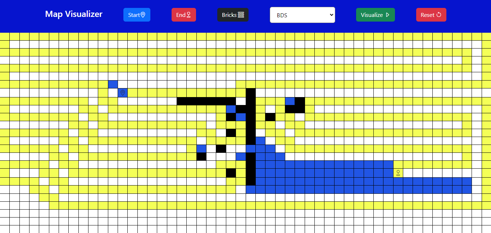

<div align="center">

  
  <h1>Algo Pathfinding Visualizer</h1>
   
<h2>
    <a href="https://algo-visualizer-board.vercel.app/">Demo</a>
  </h2>
</div>

<br />

<!-- Hosting -->
## :gear: Hosting

  - Front End  - `Github Pages`

<!-- Table of Contents -->
# :notebook_with_decorative_cover: Table of Contents

- [About the Project](#star2-about-the-project)
  * [Screenshots](#camera-screenshots)
  * [Tech Stack](#space_invader-tech-stack)
  * [Features](#dart-features)
- [Getting Started](#toolbox-getting-started)
  * [Installation](#gear-installation)
  * [Run Locally](#running-run-locally)
  * [Deployment](#triangular_flag_on_post-deployment)


<!-- About the Project -->
## :star2: About the Project
  Built Algo path finding visualizer is to find path between start and end point using DFS and BFS graph algorithms 

<!-- Screenshots -->
### :camera: Screenshots

<div align="center"> 
  
</div>
<div align="center"> 
  
</div>


<!-- TechStack -->
### :space_invader: Tech Stack

  <ul>
    <li><a href="https://reactjs.org/">React.js</a></li>
    <li><a href="https://getbootstrap.com/">Bootstrap</a></li>
  </ul>
    


<!-- Features -->
### :dart: Features

- BFS and DFS Graph Algorithms
- Modify Start And Target Location
- Add Bricks


<!-- Getting Started -->
## 	:toolbox: Getting Started

<!-- Run Locally -->
### :running: Run Locally

Clone the project

```bash
  Clone the project
```

Go to the project directory

```bash
  cd my-project
```

Install dependencies

```bash
  npm install
```

Start the server

```bash
  npm start
```


<!-- Deployment -->
### :triangular_flag_on_post: Deployment

To deploy this project run

```bash
  npm run deploy
```


<!-- License -->
## :warning: License

Distributed under MIT License.


